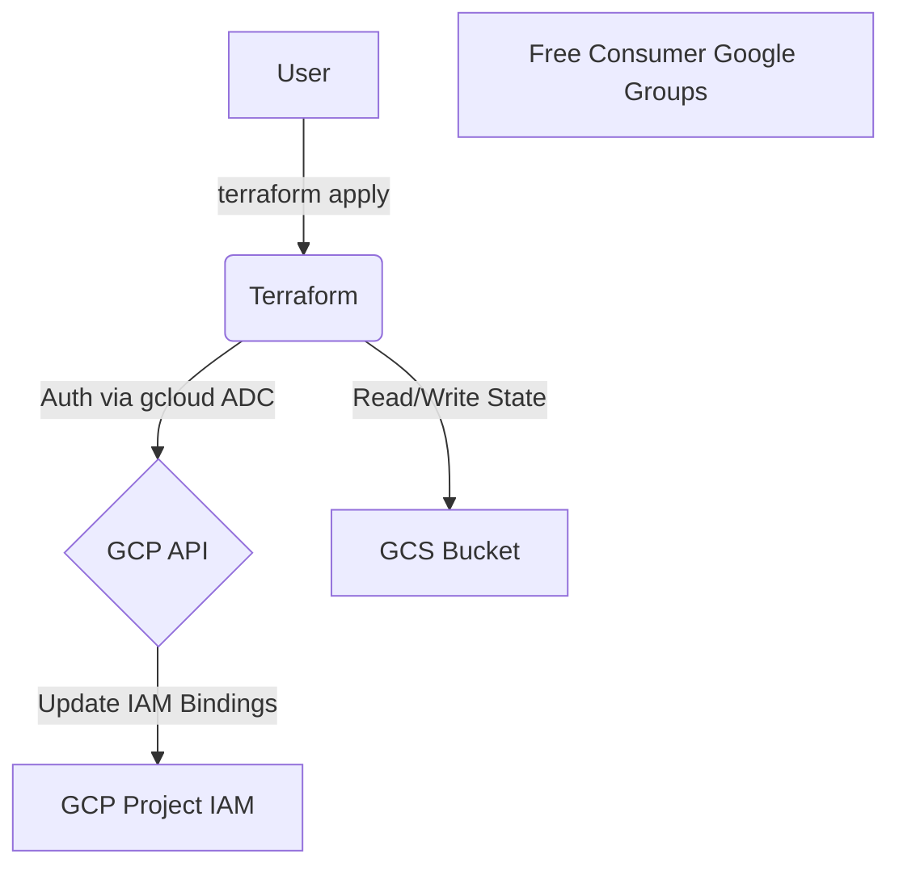
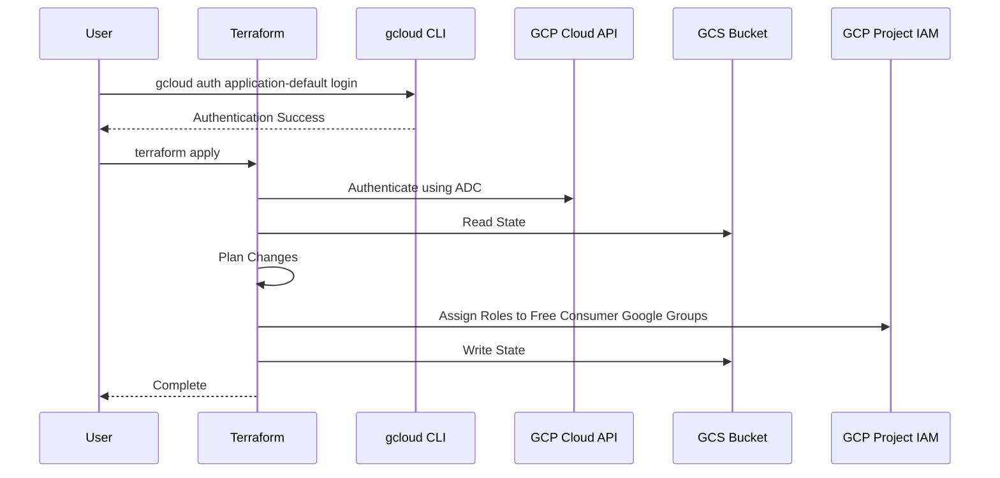

# terraform-gcp-iam-rbac-google-groups

This Terraform project manages GCP IAM RBAC by assigning roles to free consumer Google Groups. No Google Cloud Organization required! It uses GCS for remote state.

## What It Does

This project lets you easily give GCP project access to many people using free Google Groups! You:
1. Create a free Google Group at https://groups.google.com
2. Add people's Gmail accounts to the group
3. Use this Terraform project to give the group access to your GCP project

## What It Allows

- **Manage access for many people easily**: Just add/remove people from the Google Group - no need to update GCP IAM for each person
- **Works with free Gmail accounts**: Anyone with a Gmail can join your group and get access
- **No paid services needed**: You don't need Google Workspace or a Cloud Organization
- **Control what people can do**: Give groups different roles (like admin, viewer, etc.)

## Use Cases

- **Share your GCP project with friends/teammates**: Everyone uses their own Gmail
- **Manage a small team**: Keep track of who has access in one place
- **Give temporary access**: Add someone to the group for a project, then remove them later
- **Separate roles**: Have one group for admins and another for people who just need to view things

## Architecture



### Sequence Diagram


## Prerequisites

1. **Google Cloud SDK**: https://cloud.google.com/sdk/docs/install
2. **Terraform**: https://developer.hashicorp.com/terraform/downloads
3. **Free Consumer Google Groups**: Create groups manually at https://groups.google.com (no Google Cloud Organization required!)

## Setup & Deployment

### Step 1: Create Free Consumer Google Groups Manually
- Go to https://groups.google.com
- Create new groups (e.g., `my-free-devops-team@googlegroups.com`, `my-free-dev-team@googlegroups.com`)
- Add team members' email addresses directly in the Google Groups UI

### Step 2: Configure Group Security Settings (Important!)
- Set "Who can view conversations" to **Group members** (NOT "Anyone on the web")
- Set "Who can join the group" to **Only invited users**

### Step 3: Configure Terraform
1. **Authenticate and Select Project**:
   This project uses your local `gcloud` credentials for authentication.

   ```bash
   # Authenticate
   gcloud auth application-default login

   # Select your project
   gcloud config set project your-project-id
   ```

2. **Create and Configure Backend Bucket (One-time)**:
   Create the GCS bucket for Terraform state and enable versioning (required for state locking):

   ```bash
   # Create the bucket (replace with your bucket name and region)
   gcloud storage buckets create gs://your-tfstate-bucket --location=us-central1

   # Enable versioning (required for state locking)
   gcloud storage buckets update gs://your-tfstate-bucket --versioning
   ```

3. **Configure Backend Variables**:
   Create a `backend.tfvars` file based on the example:

   ```hcl
   bucket = "your-tfstate-bucket"
   prefix = "terraform-iam-rbac"
   ```

   > **Note**: `backend.tfvars` and `terraform.tfvars` contain your specific configuration and are excluded from version control (see `.gitignore`).

4. **Configure Main Variables**:
   Create a `terraform.tfvars` file based on the example:

   ```hcl
   project_id       = "your-gcp-project-id"
   region            = "us-central1"

   team_permissions = {
     "my-free-devops-team@googlegroups.com" = [
       "roles/compute.admin",
       "roles/run.admin",
       "roles/cloudbuild.admin",
       "roles/storage.admin"
     ],
     "my-free-dev-team@googlegroups.com" = [
       "roles/compute.viewer",
       "roles/run.developer",
       "roles/cloudbuild.editor",
       "roles/storage.objectUser"
     ]
   }
   ```

5. **Initialize Backend (One-time)**:
   ```bash
   terraform init -backend-config=backend.tfvars
   ```

6. **Validate Configuration**:

   ```bash
   terraform validate
   ```

7. **Plan Changes**:

   ```bash
   terraform plan
   ```

8. **Apply Changes**:

   ```bash
   terraform apply
   ```

---

## Usage as a Module

Reference this repository as a Terraform module in your own configurations:

```hcl
module "iam_rbac_groups" {
  source = "github.com/marcuwynu23/terraform-gcp-iam-rbac-google-groups?ref=main"

  project_id = var.project_id
  region     = "us-central1"

  team_permissions = {
    "team-admins@googlegroups.com" = [
      "roles/compute.admin",
      "roles/storage.admin"
    ],
    "team-developers@googlegroups.com" = [
      "roles/compute.viewer",
      "roles/storage.objectViewer"
    ]
  }
}
```

All [variables](#variables) documented below are available when using this as a module.
